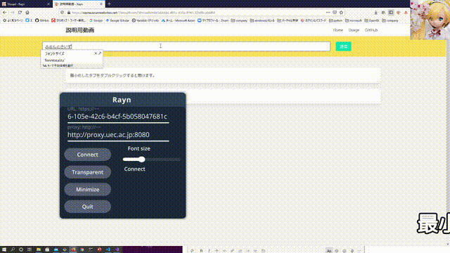

# [Reaction is All You Need. (Rayn🌧)](https://raynw.azurewebsites.net/)
画面共有でニコ〇コとかビ〇ビリみたいにコメントを流すためのソフトウェア。ほぼほぼC#製。

- アプリ: [https://raynw.azurewebsites.net/](https://raynw.azurewebsites.net/)
- Full demo video: [yotube](https://youtu.be/fFvW8ybUVVY)



# Server(ASP.NET Core)
## Require
- [.NET5](https://dotnet.microsoft.com/download/dotnet/5.0)

## Usage
Linux/Macだともしかしたら以下のコマンドが必要になるかもしれない。WindowsでVisual Studio使っている場合は特に気にする必要なし。

```
dotnet tool install -g Microsoft.Web.LibraryManager.Cli
```

ログとか残す気がないのであればDBとかを建てないで良い。Azure App Serviceなど単体で簡単に動かせる。

ローカルの開発環境ではUserSecretsに以下みたいな形で設定してDBの接続文字列とかを保存。

```
{
    "DatabaseConfig": {
        "ConnectionString": "Server=...; Port=...",
        "InMemoryMode": false
    }
}
```

InMemoryModeをtrueにしておけばインメモリで動くためデータベース用意してなくてもOK。その他環境では環境変数などGenericHostが拾ってくれるところに`DatabaseConfig`を設定。ユーザーシークレットではなく環境変数に設定する場合は以下みたいな感じ。

```
export DatabaseConfig__ConnectionString="Server=...; Port=..."
export DatabaseConfig__InMemoryMode="false"
```

上記の設定が出来たら以下の操作で試せます。
```
cd src/RaynServer/Rayn/Rayn
dotnet run --project Rayn.csproj
```

# Client(Unity 2020.3.1)
Windows/Mac両対応

## Require
このリポジトリには含まれていないので、それぞれ.unitypackage落としてきてください。
- OSS
  -  [neuecc/UniRx 7.1.0](https://github.com/neuecc/UniRx/releases/tag/7.1.0)
  -  [neuecc/Utf8Json](https://github.com/neuecc/Utf8Json/releases/tag/v1.3.7)
  -  [Cysharp/UniTask 2.2.4](https://github.com/Cysharp/UniTask/releases/tag/2.2.4)
  -  [kirurobo/UniWindowController 0.8.0](https://github.com/kirurobo/UniWindowController/releases/tag/v0.8.0)
-  Asset store
   - [Modern UI Pack](https://assetstore.unity.com/packages/tools/gui/modern-ui-pack-150824?locale=ja-JP)


またSignalRのDLLを
git bash等で以下の様な操作を行いダウンロードします。
```
cd src/Prepare
./download_signalr_dlls.sh
```
必要なdllが`dlls`というディレクトリに出力されるので、出力されているdllを全て`src/RaynClient/Assets/Plugins/SignalR`に投げ入れてください。

Unityなのでコメントに合わせて3Dがポップするとかの改造も容易です。
